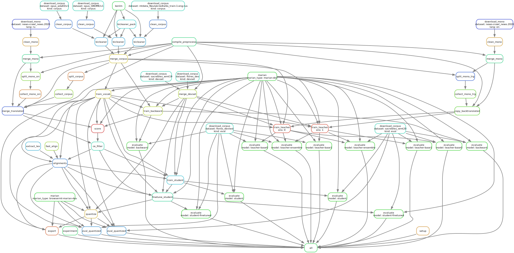

# Pipeline steps

The pipeline steps are based on the [train-student](https://github.com/browsermt/students/tree/master/train-student) recipe.
They can be represented as a Directly Acyclic Graph (DAG) ([svg](img/DAG.svg)).

Step | Description | Bottleneck | Comments
--- | --- | --- | ---
Installation | Installing dependencies and compiling | CPU | Takes ~1 hour
Data downloading | Downloads datasets, samples sentences | Network, Disk | Time depends on dataset size, sampling of huge mono datasets (100M+ sentences) is the most intensive operation.
Data cleaning | Basic preprocessing, dataset specific, language specific, rule based and other attempts to clean noisy data in parallel and mono datasets | CPU | Good parallelization across CPU cores. To make cleaning of a new language more efficient add it to [clean_parallel.py](https://github.com/mozilla/firefox-translations-training/tree/main/pipeline/clean/tools/clean_parallel.py).
Bicleaner | Filters noisy sentence pairs in a parallel corpus using [bicleaner](https://github.com/bitextor/bicleaner) or [bicleaner-ai](https://github.com/bitextor/bicleaner-ai) depending on available language packs. | CPU, GPU | If there are no pretrained language packs for bicleaner-ai, it uses bicleaner. If there are no ones for bicleaner either, this step is skipped. Cleaning thresholds are configurable per dataset, see [Dataset cleaning](##Dataset cleaning).
Merge and dedupe | Merges clean dataset and applies deduplicaiton | CPU, Disk | 
Training vocabulary | Trains [SentencePiece](https://github.com/google/sentencepiece) vocabulary/tokenizer model on parallel corpus. | CPU |
Training s2s | Trains a backward shallow s2s model, which is useful for back-translations and ce-filtering | GPU | Inspired by a [marian example](https://github.com/marian-nmt/marian-examples/tree/master/training-basics-sentencepiece).
Augmentation with back-translations | Translates mono corpus combined from monolingual datasets in target language using shallow s2s model. | GPU | It is more useful for low-resource languages and can be skipped for others.
Training teacher | Trains an ensemble of big transformer models on augmented dataset | GPU | You might want to adjust [early stopping](https://github.com/mozilla/firefox-translations-training/tree/main/pipeline/train/configs/training/teacher.train.yml) depending on dataset size.
Translation by teacher | Translates a corpus and monolingual data combined from configurable `dataset.mono-src` using the ensemble of teacher models | GPU | The slowest part of the pipeline. Can take days. It is possible to speed it up by using multiple nodes in cluster mode.
Cross-entropy filtering | Scores translated corpus with backward s2s model and removes a part of the corpus with the lowest scores to reduce noise | GPU, CPU, Disk | At this point we work with huge datasets. Very disk intensive.
Training alignments and shortlist | Trains alignments using [fast_align](https://github.com/clab/fast_align) and extracts lexical shortlist using [extract_lex](https://github.com/marian-nmt/extract-lex) tool | CPU, Disk | Some tools require uncompressed datasets on disk and they are huge at this point. Good CPU parallelization.
Training student | Trains a small transformer student model on filtered data and using alignments. Shuffling in RAM might fail if dataset is huge and there's not enough RAM on the machine, so it's recommended to remove it and use `shuffle: batches` marian settings (see [issue](https://github.com/mozilla/firefox-translations-training/issues/21)).  | GPU |
Fine-tuning student | Finetunes the student model by emulating 8bit GEMM during training | GPU | Converges very quickly and then degrades. It's quick but you might want to reduce early stopping threshold.
Quantizaiton |  Applies 8 bit quantization to the fined-tuned student model and runs evaluation on CPU | CPU | CPU threads must be set to 1 for this step.
Evaluation |  Calculates metrics for all models (BLEU, chrf) using [SacreBLEU](https://github.com/mjpost/sacrebleu) | GPU | Uses `datasets.test` configuration section.
Export | Exports trained model and shortlist to (bergamot-translator)(https://github.com/mozilla/bergamot-translator) format | |
