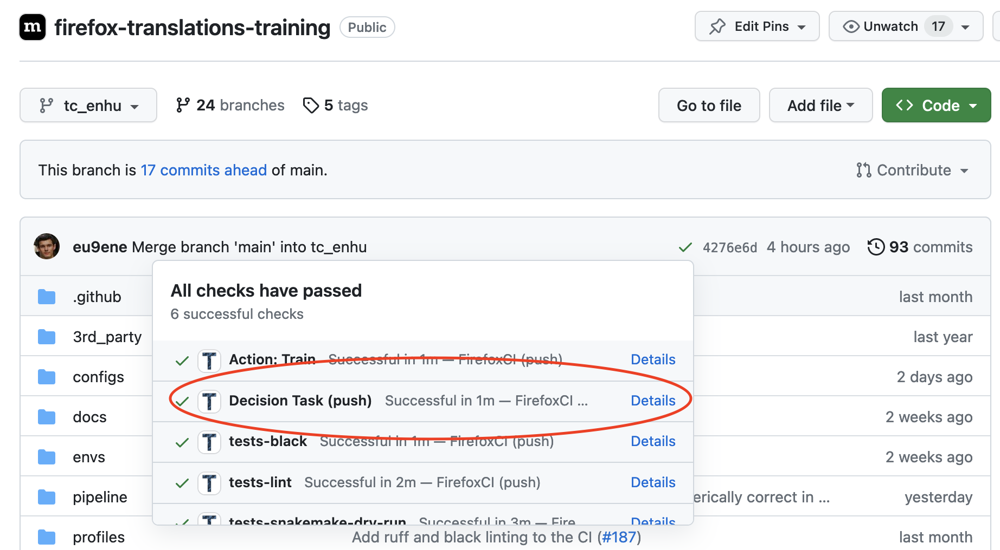
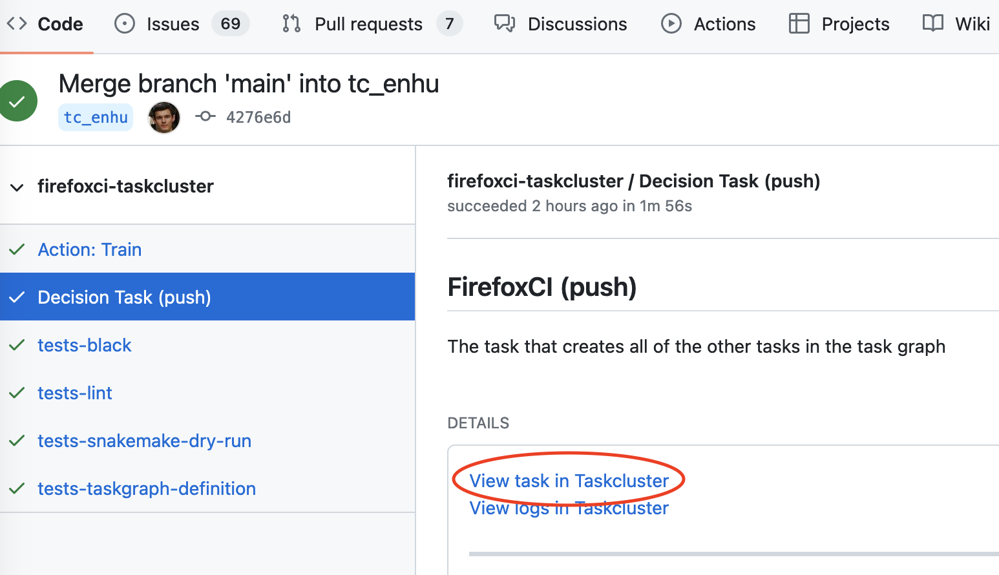
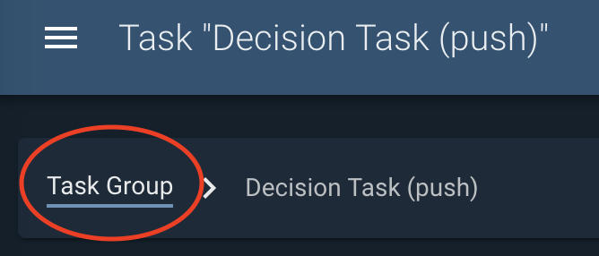
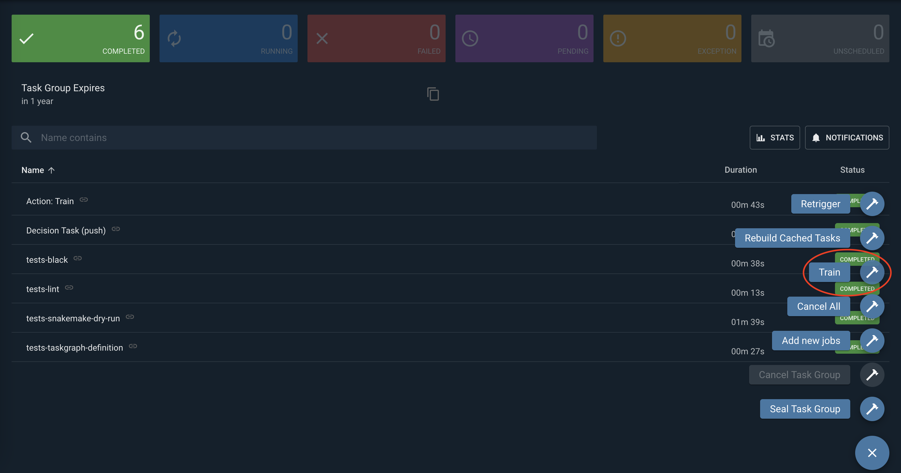
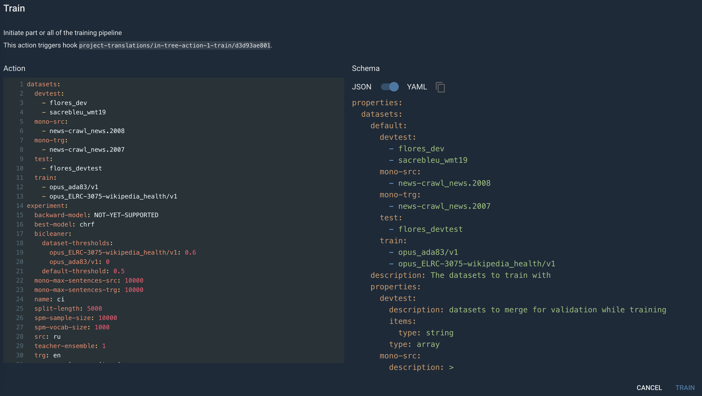

# Taskcluster

[Taskcluster](https://taskcluster.net/) is a Mozilla task execution framework. It powers Firefox CI and
provides access to the hybrid cloud workers (GCP or on-prem) 
which increases scalability and observability compared to [Snakemake](snakemake.md). 

We use [Taskcluster taskgraph](https://taskcluster-taskgraph.readthedocs.io/en/latest/) to define the DAG 
(Directly Acyclic Graph) of the pipeline steps.

## Running training

1. Create a new branch in the git repo and push. 
   It is useful to experiment with code and also not to get the caches invalidated if you need to restart training and some new changes were landed in the main branch.
    
2. Go to Github CI for the commit you want to run training for and find a Decision Task



3. Go to CI and press "View task in Taskcluster". 
   Make sure you are authenticated in the TC interface. It is required to run tasks. 
   However, already running tasks can be viewed without authentication.



4. In TC interface navigate to a parent Task Group



5. Press "Train" in the 3-dot menu for actions



6. Copy a config prepared in advance and press "train". See the example TC config [here](/configs/tc.prod.yml). 
   You can find directions on how to configure training in the [Model training guide](training-guide.md).



## Checking the status of training

1. Look at the scheduled tasks. They should be visible under the Train action.


2. Press any task. Here you can look at the logs and artifacts produced by the task.
   


3. Navigate to a parent Task Group again (it is a different one than for the Train Action). 
   Here you can see all the scheduled tasks in a more convenient interface with filtering.


## Rerunning

Quite often you need to rerun the pipeline after making fixes or when a task fails.

It is possible to manually cancel a task with the Cancel task action.


After the fixes were implemented, push again and restart the pipeline with the same procedure 
as described in the "Running training" section.

### Caching

Some steps might be already cached from the previous run depending on the fixes. 
For example if only a config setting that affects the last task was changed,
or if nothing changed at all the pipeline might restart from the failed/cancelled step.

Warning: even a slight refactoring of the upstream steps can invalidate caches for the whole pipeline completely, 
so it's better to be careful with that when experimenting with the later stages of the pipeleine.


## Running up to a specific step

Change `target-stage: all` in the training config to a stage that corresponds to another TC step. 
For example, to download, clean and merge the training corpus use:
```
target-stage: merge-corpus
```
that corresponds to `stage: merge-corpus` in [/taskcluster/ci/merge-corpus/kind.yml](/taskcluster/ci/merge-corpus/kind.yml):
```
tasks:
    merge-corpus:
        label: merge-corpus-{src_locale}-{trg_locale}
        description: merge corpus for {src_locale}-{trg_locale}
        attributes:
            dataset-category: train
            stage: merge-corpus
```
