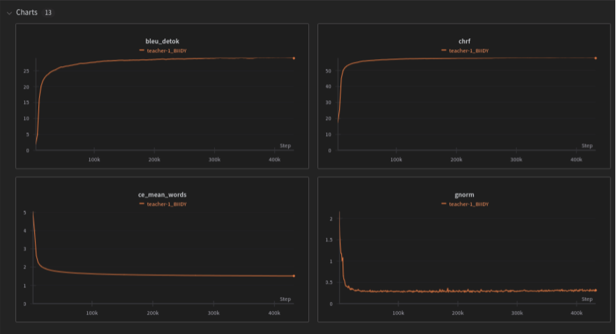
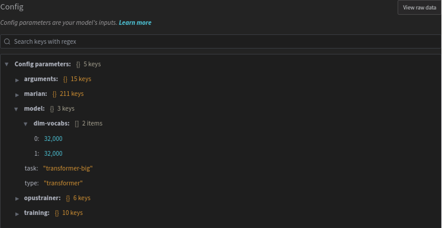
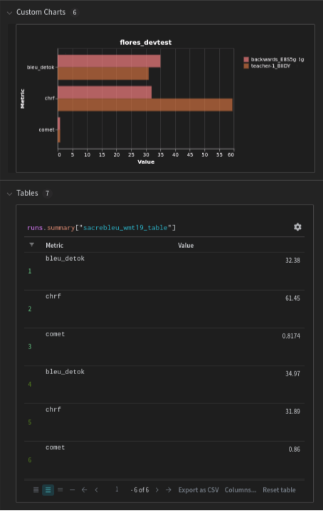
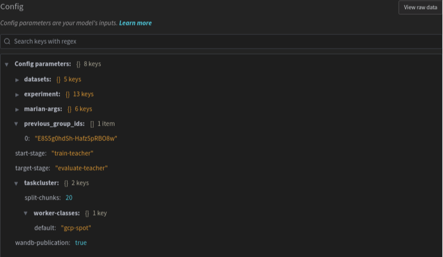
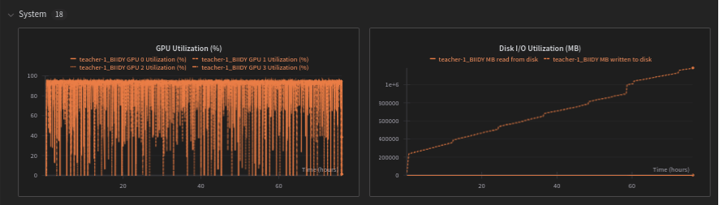

# Experiment tracking

The [tracking module](/tracking) handles parsing training logs to extract [Marian](https://marian-nmt.github.io/) training metrics in real time.

The parser supports different sources:
* Online publication from Taskcluster training or evaluation tasks.
* Deferred publication from a Taskcluster task or group of tasks.
* Deferred publication from a local directory containing archived training data.

## Parser

The parser supports writting metrics to [Weight & Biases](https://wandb.ai/) external storage (see the [section above](#weight-&-biases-dashboard)), or produce local artifacts (CSV files).

It actually supports logs from **Marian 1.10** and **Marian 1.12**. Above versions (even minor) will raise a warning and may result in missing data.

### Real time publication from Taskcluster

Publication is implemented within the training (`pipeline.train.train.get_log_parser_command`) and evaluation (`pipeline.eval.eval.main`). This is the prefered way to track metrics, as machine resource usage will also be published to Weight & Biases.

Any new experiment will automatically be published to the [public Weight & Biases dashboard](https://wandb.ai/moz-translations/projects).

Any new pull request will trigger publication to the `ci` project in Weight & Biases. You may want to edit a value in `taskcluster/configs/config.ci.yml` (e.g. the first `disp-freq` entry) to force a new publication, because of Taskcluster cache.

### Deffered publication from Taskcluster

It is possible to use the parser on Taskcluster's tasks that have finished.
The parser supports reading training tasks directly from the Taskcluster API (no authentication).

This method is useful to reupload data of past training and evaluation tasks.

You can run the parser on a Taskcluster group by running:
```sh
$ parse_tc_group <task_group_id>
```
By default, this command will fetch other traversal tasks (related experiments). You can avoid this behavior by using the `--no-recursive-lookup` option.

You can also run the parser based on the logs of a single task:
```sh
parse_tc_logs ----input-file=live_backing.log
```

### Deffered publication from a GCP archive

The parser supports browsing a folder structure from a GCP archive of multiple training runs.
This method is useful to reupload data of past training and evaluation tasks that are not available anymore from Taskcluster (expired) or when handling a large amount of data.

The structure from experiments that ran on Taskcluster should look like this:
```
.
├── logs
│   └── en-hu
│       └── baseline_enhu_aY25-4fXTcuJNuMcWXUYtQ
│           └── student
│               ├── train.log
│               └── …
└── models
    └── en-hu
        └── baseline_enhu_aY25-4fXTcuJNuMcWXUYtQ
            └── evaluation
                ├── speed
                │   ├── sacrebleu_wmt09.metrics
                │   └── …
                └── student
                    ├── flores_devtest.metrics
                    └── …
```

The structure from older experiments that ran with Snakemake should look like this:
```
.
├── logs
│   └── …
└── models
    └── en-sv
        └── opusmt-multimodel-test
            ├── evaluation
            │   └── speed
            │       ├── tc_Tatoeba-Challenge-v2021-08-07.metrics
            │       └── …
            ├── student-finetuned
            │   ├── train.log
            │   └── valid.log
            └─ …
```

## Weight & Biases dashboard

The publication is handled via the extensible module `translations_parser.publishers`.

### Structure

Runs on Weight & Biases are groupped by expermient. The group is suffixed by the complete Taskcluster group ID, and each of its runs (train or evaluation) is prefixed by the first 5 characters. This is required to compare runs with similar name (e.g. `teacher-1`) among different groups.

### Training data

Metrics parsed in real time during the training are published in the **Charts** section of Weight & Biases.



Training runs have their Marian and Opustrainer configuration published to the **Overview** section in Weight & Biases.



### Evaluation metrics

Metrics from evaluation tasks are published as table artifacts on Weight & Biases, with a custom chart for better comparison among runs.



### Group logs

On every group, a last run named `group_logs` is also published. This group does not represent a training nor evaluation task, but contains the overall experiment configuration in the **Overview** link in the left menu.



This run also contain a table published as artifact, with a summary of all evaluation metrics which is visible in the **Tables** section.


### System charts

When running online from Taskcluster, the resources used by the machine will be published in a **System** section of Weight & Biases.



## Development

The parser can be built as a distinct package to make developments easier using pip.

### Installation

On a virtual environment, you can install the package in editable mode (i.e from the local folder):
```sh
$ pip install -e ./tracking
```

### Extend supported Marian metrics

The parser does not supports arbitrary metrics (i.e. via the `--valid-metrics` argument).

In order to support new values, you may want to update the regular expression matching Marian output lines in `tracking.translations_parser.parser` and the dataclass in `tracking.translations_parser.data`.
