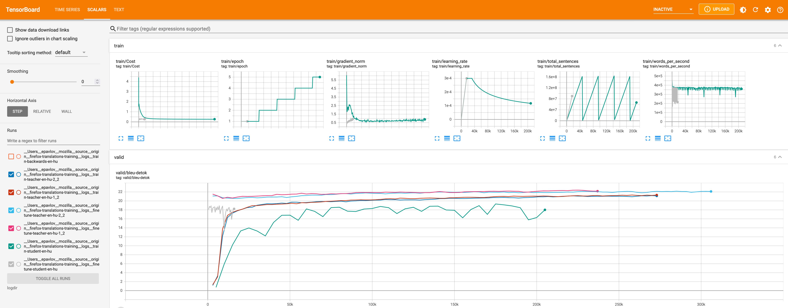

# Model training guide

A step-by-step guide on how to train a translation model.

The configuration of the training run happens mostly in the training configuration file.
Look at the examples of the full production configs for
[Taskcluster](https://github.com/mozilla/firefox-translations-training/tree/main/configs/tc.prod.yml) and
[Snakemake](https://github.com/mozilla/firefox-translations-training/tree/main/configs/config.prod.yml).

## 1. Choose a language

First, choose a language pair to train.

Considerations:
- The size of the parallel corpus on [OPUS](https://opus.nlpl.eu/)
- Availability of monolingual data. The pipeline requires monolingual data in both source and target languages. 
  Currently we support automatic donwloading only for [news crawl](https://data.statmt.org/news-crawl/)
- Availability of [bicleaner-ai models](https://github.com/bitextor/bicleaner-ai-data/releases)


Copy the [example config](https://github.com/mozilla/firefox-translations-training/tree/main/configs/tc.prod.yml) from the `/configs` directory to modify.

Then change the language pair and the name of the experiment:
```
experiment:
  name: test-quality
  src: ru
  trg: en
```

## 2. Find datasets

### Parallel corpus
1. Go to [OPUS](https://opus.nlpl.eu/) and see how much data is available for the language pair
2. Go to [statmt22](https://www.statmt.org/wmt22/translation-task.html), [statmt21](https://www.statmt.org/wmt21/translation-task.html) etc.
   and check if the language pair participated in a competition.
   If yes, there's a good chance some extra data is available for training.
3. Use [find-corpus](https://github.com/mozilla/firefox-translations-training/tree/main/utils/find-corpus.py) tool to get OPUS datasets.
Install [poetry](https://python-poetry.org/) first, then run:
```
make install-utils
python utils/find-corpus.py en ru opus
```
5. In the same way search for mtdata datasets
```
python utils/find-corpus.py en ru mtdata
```
6. Look what's there and remove old versions of datasets
   (for example there should be only mtdata paracrawl v9 left like `mtdata_ParaCrawl-paracrawl-9-eng-swe`)
7. Deduplicate datasets between OPUS and mtdata (for example, remove `opus_ParaCrawl/v8`).
   If the versions are the same I prefer OPUS ones as a more stable resource.

Copy the datasets in the training config:
```
datasets:
  train:
    - opus_ada83/v1
    - mtdata_Statmt-news_commentary-15-eng-rus
    ...
```
It's hard to say how much data is required to train something useful.
Probably, at least 10 million sentences. Ideally 100M+ to get the best quality.

In the pipeline, the datasets will be deduplicated based on source and target sentences together using the [dedupe tool](https://github.com/kpu/preprocess). However, if different datasets contain the same source sentence, and different target sentences, they will all be retained.

### Evaluation datasets
- There might be statmt datasets available. For example `sacrebleu_wmt20`.
  Run find-corpus to search using the [SacreBLEU tool](https://github.com/mjpost/sacrebleu):
```
python utils/find-corpus.py en ru sacrebleu
```
- Use some datasets for validation while training (`datasets.devtest` section) and others for evaluation (`datasets.test`).
- Flores dataset is available for 100 languages, so it's always a good idea to add `flores_dev` for validation and `flores_devtest` for the final evaluation of the model.
- Some OPUS and mtdata datasets provide dev and devtest versions, so it's a good idea to add them to evaluation.
- Make sure that training, validation and evaluation datasets are different.

```
  # datasets to merge for validation while training
  devtest:
    - flores_dev
    - sacrebleu_wmt19
    - sacrebleu_wmt17
  # datasets for evaluation
  test:
    - flores_devtest
    - sacrebleu_wmt20
    - sacrebleu_wmt18
```

### Monolingual corpus
It is recommended to use back-translations to augment training data by training a model in reversed direction and then 
translating a monolingual corpus in target language to the source language
(see [Improving Neural Machine Translation Models with Monolingual Data](https://aclanthology.org/P16-1009.pdf)).

It is also important to use monolingual corpus in source language to augment data for decoding by the teachers 
to improve teacher-student knowledge distillation (see [Sequence-Level Knowledge Distillation](https://arxiv.org/abs/1606.07947)).

Those techniques are useful even for high-resource languages but especially useful for low-resource ones. 
The only limitation is probably available computational resources.

Find monolingual data and add it to `datasets.mono-src` and `datasets.mono-trg`. 
Using [News Crawl](https://data.statmt.org/news-crawl/) datasets from statmt is preferable
because they are relatively clean, and the pipeline supports automatic downloading for them.
```
  # to be translated by the ensemble of teacher models
  mono-src:
    - news-crawl_news.2020
    - news-crawl_news.2019
    ...
  # to be translated by the backward model to augment teacher corpus with back-translations
  mono-trg:
    - news-crawl_news.2020
    - news-crawl_news.2019
    ...
```

### Custom local datasets

It is also possible to use manually downloaded datasets with prefix `custom_<file_path>`.

Find more details about the supported dataset importers [here](data.md).

## 3. Configure data cleaning

To use the default data cleaning pipeline set:
```
  use-opuscleaner: false
```

Make sure the language is present in [clean_parallel](https://github.com/mozilla/firefox-translations-training/tree/main/pipeline/clean/tools/clean_parallel.py#L19) script.

For more details on data cleaning see the documents on [Data cleaning](cleaning.md) [Bicleaner](bicleaner.md).

## 4. Set hyperparameters

The pipeline supports overriding the default [Marian settings](https://marian-nmt.github.io/docs/cmd/marian/) in the training config. The default settings are in the `pipeline/train/configs` directory,
for example [`teacher.train.yml`] and in the [`train.sh`] script.

[teacher.train.yml]: https://github.com/mozilla/firefox-translations-training/tree/main/pipeline/train/configs/training/teacher.train.yml
[train.sh]: https://github.com/mozilla/firefox-translations-training/tree/main/pipeline/train/train.sh

### Model training

#### Early stopping
Early stopping can be increased to make sure that training converges.
However, it depends on the language and might not bring much benefit but will make the training longer.
So, you can start with `early-stopping: 20`, monitor the training and increase it if the model stops training too early.
```
marian-args:
# these configs override pipeline/train/configs
  training-backward:
    early-stopping: 5
  training-teacher:
    early-stopping: 20
```

#### Optimizer delay
Make sure to set `optimizer-delay` so that `GPU devices * optimizer-delay = 8`.
It makes training more stable.

#### Subword regularization
```
sentencepiece-alphas: 0.5
```
SentencePiece alphas control the alpha parameter in subword sampling for the unigram model. 
It improves robustness of the model, especially for unseen domains. 

If not specified, Marian does not run SentencePiece sampling (corresponds to `alpha=1`). 
Lower values (`0.1`, `0.2`) increase randomization and might benefit lower resource languages with less diverse datasets. 
However, the model might not train at all if the alpha is too low. 
The recommended value to start with is `0.5`.

More details:
- [SentencePiece readme](https://github.com/google/sentencepiece?tab=readme-ov-file#subword-regularization-and-bpe-dropout)
- Paper [Subword Regularization: Improving Neural Network Translation Models with Multiple Subword Candidates](https://arxiv.org/pdf/1804.10959.pdf)

### Decoding (translation)

`mini-batch-words` can be set depending on available GPU memory and the number of teachers.
It affects the batch size and decoding speed for the `translate` steps.
```
marian-args:
...
  decoding-backward:
    # 12 Gb GPU, s2s model
    mini-batch-words: 2000
  decoding-teacher:
    # 12 Gb GPU, ensemble of 2 teachers
    mini-batch-words: 1000
```

#### Half precision decoding

Make sure to use it only for teacher models and on GPUs that support it.
It speeds up decoding but can slightly decrease quality.
```
marian-args:
...
  decoding-teacher:
    # 2080ti or newer
    precision: float16
```

### Data augmentation and curriculum learning

You can adjust data augmentation settings to increase robustness of the translation and
tune how to mix back-translated corpus with the original one in the
[OpusTrainer configs](https://github.com/mozilla/firefox-translations-training/tree/main/pipeline/train/configs/opustrainer/).

See [OpusTrainer docs](opus-trainer.md) for more details.

## 5. Run the pipeline

Follow the instructions that correspond to the workflow manager you will be using 
([Taskcluster](task-cluster.md), [Snakemake](snakemake.md)).

Find the full description of the pipeline steps [here](pipeline-steps.md).

### Cluster specific configuaiton

The Marian workspace is usually safe to set to about 3/4 of available GPU memory 
(in a [profile for Snakemake](https://github.com/mozilla/firefox-translations-training/tree/main/pipeline/train/train.sh) and throughout the ci steps in Task cluster).
Setting a higher value speeds up training but might lead to out of GPU memory error.

### Taskcluster

Follow [this guide](task-cluster.md) to run the pipeline on Taskcluster.

You can run it up to a specific step using a config setting. 
For example to only train the teacher model:
```
target-stage: train-teacher
```

### Snakemake

After everything is configured do `make run`. It will compile Marian and other tools first which is important to do on the target machine in cluster mode.

If you want to inspect data  first, run 
```
make run TARGET=merge_corpus
```

Find more details in the [Snakemake doc](snakemake.md).

#### Mozilla Slurm cluster

I usually set just one GPU partition per run in the [cluster config](https://github.com/mozilla/firefox-translations-training/tree/main/profiles/slurm-moz/config.cluster.yaml). It simplifies configuration and monitoring.

Make sure to not set `precision: float16` on `txp` partition.

## 6. Monitor progress

### Logs

Look at the logs of the pipeline steps and 
specifically at `train.log` for the training steps (`train-...`, `finetune-...`).

### Metrics

Check logs or output files `*.metrics` for `evaluate` steps to see the BLEU and chrF metrics calculated on evaluation datasets.

For Snakemake check `models/<lang-pair>/<experiment>/evaluation` folder.


### Tensorboard

It is possible to look at the training graphs in Tensorboard.

#### Taskcluster
When the training run is completed, provide a Task group id and download the training logs to a directory. 
For example for [this task group](https://firefox-ci-tc.services.mozilla.com/tasks/groups/DClbX0cjSCeQuoE1fW-Ehw):
```
LOGS_TASK_GROUP=DClbX0cjSCeQuoE1fW-Ehw make download-logs
```
#### Snakemake
Adjust the path to match the model directories in makefile `tensorboard`  command and remove `--offline` to automtically update while training.

#### Run server

```
make tensorboard
```

Then go to `http://localhost:6006` in the browser



Known issue: the [marian-tensorboard](https://github.com/marian-nmt/marian-tensorboard) tool we're using 
parses the trainig logs only for the student models and validation logs for all models for some reason.

## 7. Download the final model

The small quantized model is available in bergamot-translator compatible format as an output of the `export` step.
It includes three files: model, vocab and shortlist.

For example:
```
model.ruen.intgemm.alphas.bin.gz
lex.50.50.ruen.s2t.bin.gz
vocab.ruen.spm.gz
```

## Troubleshooting

### Dataset downloading fails

Sometime external resources we download the dataset from are unavailable.
Retry the downloading steps. 
If it still fails, remove those datasets from the config.
Taskcluster retries automatically.

### Out-of-memory

Usually, by the time we train the student, it's so much data that it might not fit in 128 GB of RAM. 
For very high-resource languages like French it can happen even earlier, on the backward/teacher training stage. 
The workaround is to remove `--shuffle-in-ram` from the [training script](https://github.com/mozilla/firefox-translations-training/tree/main/pipeline/train/train.sh) 
and add `--shuffle batches`  instead.
More details in the [issue](https://github.com/mozilla/firefox-translations-training/issues/21).


### Out of GPU memory

Reduce the Marian workspace or batch size.

### Out of disk

It happens on Taskcluster, because we train on increasingly large datasets especially close to the end of the pipeline. 
Just increase the disk size, it's cheap compared to the GPUs.
